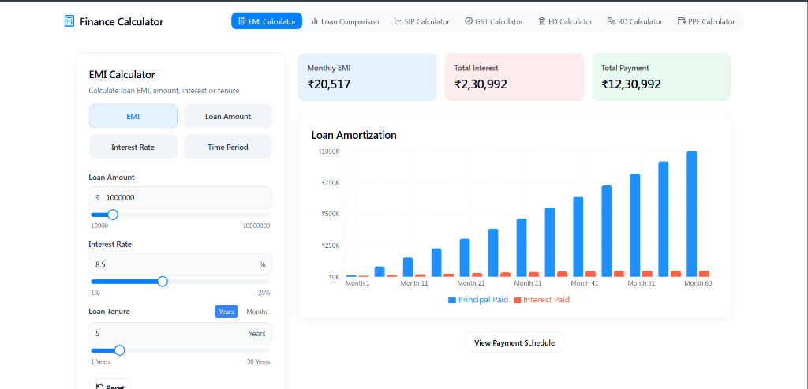
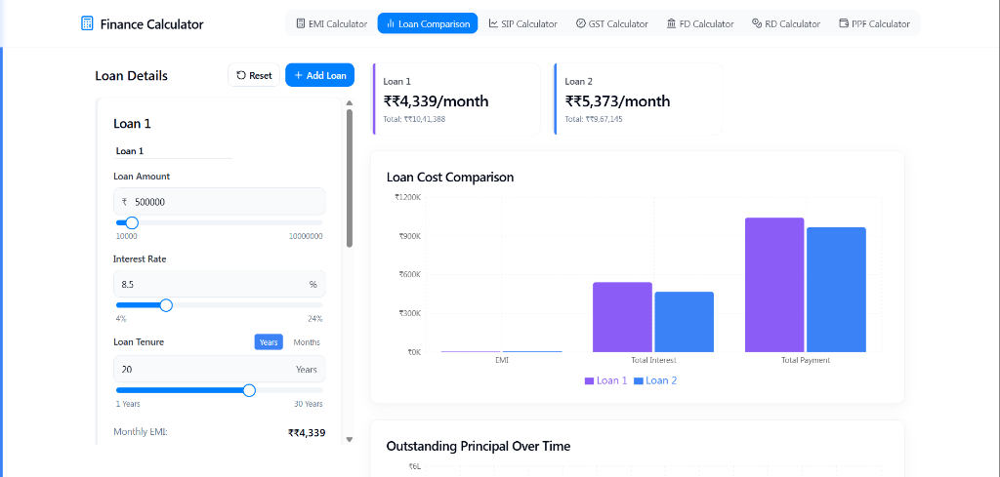
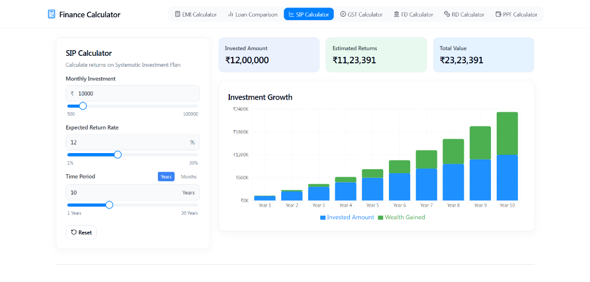
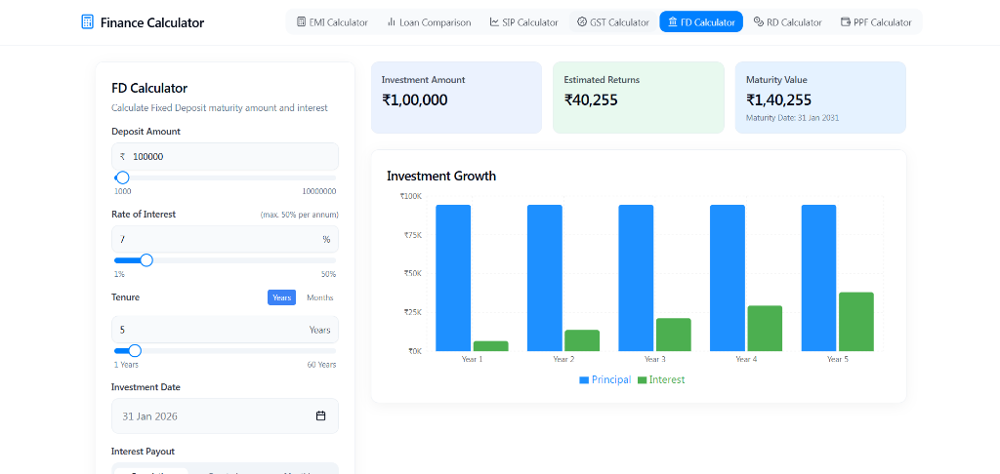
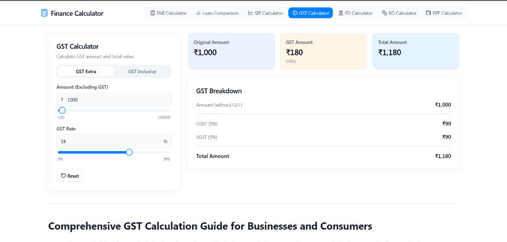
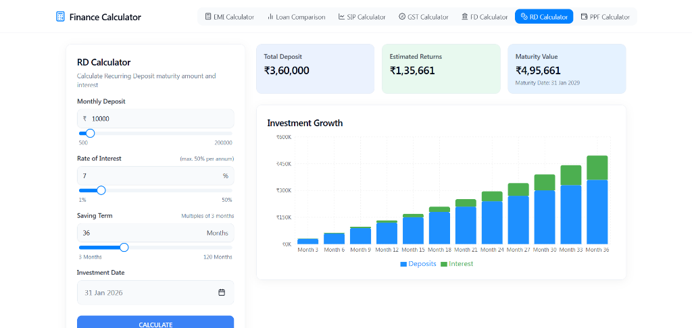
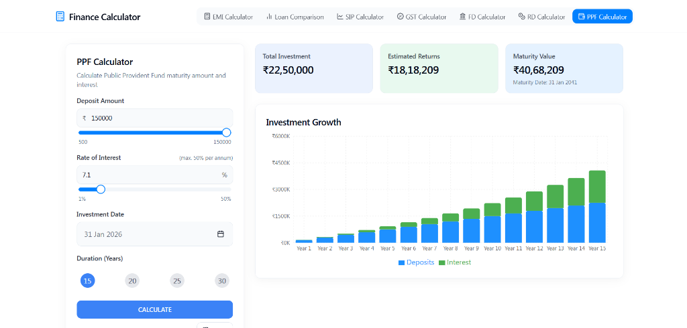

# Finance Calculator

An all-in-one financial calculator built with modern web technologies to help you plan your finances effectively. This application offers a suite of tools for calculating Loans, EMI, Investments, and Taxes with accurate real-time results and interactive visualizations.

## 🚀 Features

- **EMI Calculator**: Calculate monthly installments for Home Loans, Car Loans, and Personal Loans.
- **Loan Comparison**: Compare multiple loan offers side-by-side to choose the best option.
- **SIP Calculator**: Plan your investments with Systematic Investment Plans across different time horizons.
- **GST Calculator**: Quickly determine exclusive and inclusive GST amounts.
- **FD & RD Calculators**: Estimate returns on Fixed Deposits and Recurring Deposits.
- **PPF Calculator**: Plan retirement savings with Public Provident Fund calculations.
- **Interactive Charts**: Visualize your potential returns and payment breakdowns with dynamic graphs.

## 📸 Screenshots

### EMI Calculator
Calculate your monthly payments with ease.


### Loan Comparison
Compare different loan structures to save money.


### SIP Calculator
Visualize your wealth creation journey.


### Fixed Deposit Calculator
Estimate returns on your secure investments.


### GST Calculator
Simplifying tax calculations for businesses and consumers.


### RD Calculator
Plan your recurring deposits with accuracy.


### PPF Calculator
Secure your future with Public Provident Fund estimations.


## 🛠️ Technology Stack

- **Framework**: [React](https://react.dev/) + [Vite](https://vitejs.dev/)
- **Language**: [TypeScript](https://www.typescriptlang.org/)
- **Styling**: [Tailwind CSS](https://tailwindcss.com/)
- **UI Components**: [shadcn/ui](https://ui.shadcn.com/)
- **Charting**: [Recharts](https://recharts.org/)

## 🏁 Getting Started

The only requirement is having Node.js & npm installed - [install with nvm](https://github.com/nvm-sh/nvm#installing-and-updating)

Follow these steps:

```sh
# Step 1: Clone the repository
git clone <YOUR_GIT_URL>

# Step 2: Navigate to the project directory
cd FINANCE_CALCULATOR

# Step 3: Install dependencies
npm install

# Step 4: Start the development server
npm run dev
```

## 👤 Author

**Akash Pattanayak**
- Email: [akashpattanayak89@gmail.com](mailto:akashpattanayak89@gmail.com)

---
